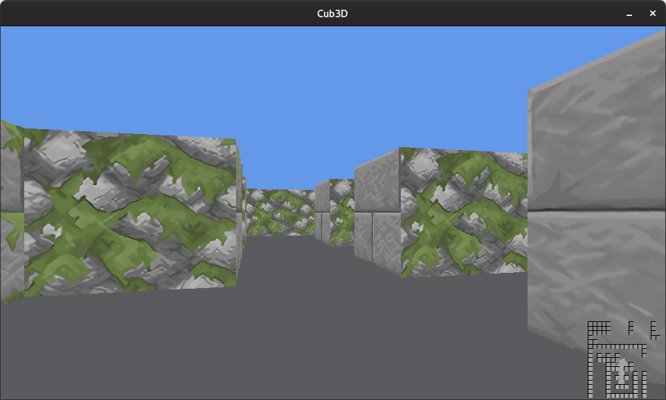
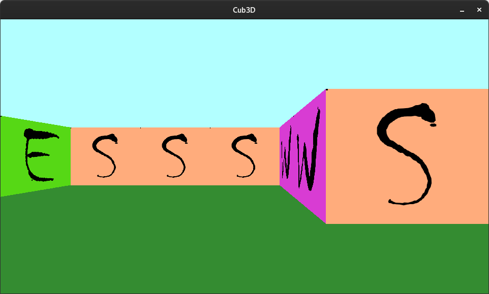
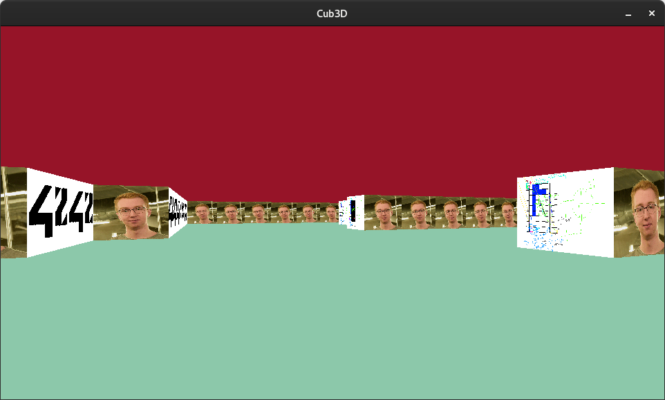
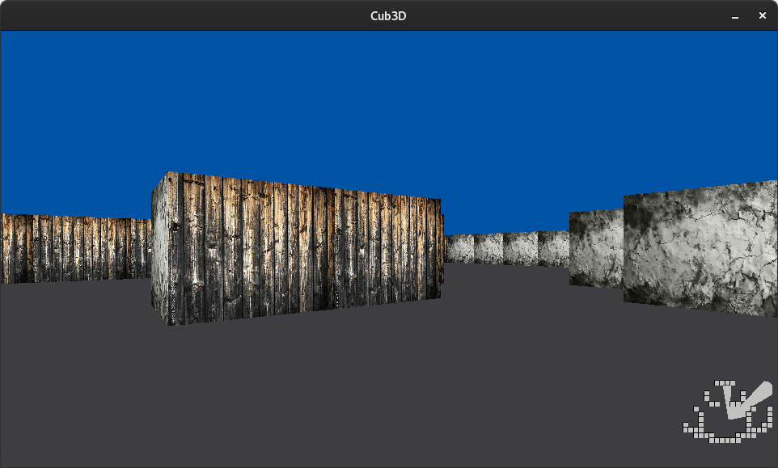

# 42 project: Cub3D (raycasting)
Cube3D is a 42 project that aims to create a 3Dgraphical representation of a maze from a first-person perspective. The program use the raycasting technique inspired by the [Wolfenstein 3D](https://en.wikipedia.org/wiki/Wolfenstein_3D) game.



# Usage

## Run
To run the program, simply execute the following command in your terminal:

```bash
make
./cub3d <map_path (.cub extension)>
```

The mapfile must be a valid mapfile with the following format:

```bash
NO ./path_to_the_north_texture
SO ./path_to_the_south_texture
WE ./path_to_the_west_texture
EA ./path_to_the_east_texture
C red,green,blue
F red,green,blue
11111111111
10001000001
10001000001
10000000001
100N0000001
11111111111
```
The map must be surrounded by walls (`1`) and contain at least one player (`N`, `S`, `E`, `W`).

## Example
```bash
./cub3D maps/ok_test4.cub
```
```bash
NO ./textures/N_wall.xpm
SO ./textures/S_wall.xpm
WE ./textures/W_wall.xpm
EA ./textures/E_wall.xpm
C 178,255,255
F 52,140,49
11111111111      1111111
10001000001   1110000001111
10001000001  1000000001
10000000001   1110000001111
100N0000001      1111111
11111111111
```



## Commands

The program supports the following commands:

+ `W`, `A`, `S`, `D` to move the player
+ `Shift` to sprint
+ `←`, `→` to rotate the camera
+ `mouse movement` to rotate the camera
+ `M` to toggle the minimap
+ `K` to toggle collision
+ `Ctrl` to zoom in
+ `ESC` to quit the program

# Screenshots





# Credits
This project was developed by [valentinValep](https://github.com/valentinValep) and [djfg0](https://github.com/djfg0) as part of the curriculum at [École 42](https://42.fr/). The project was completed using the C programming language and the [minilibx library](https://github.com/42Paris/minilibx-linux).
